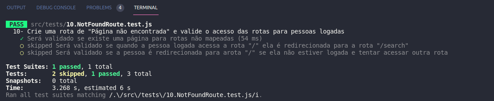
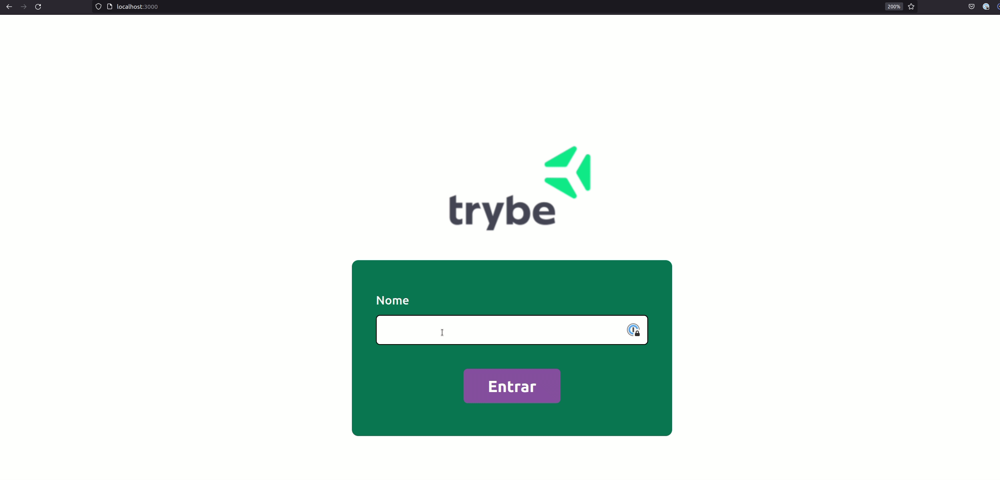
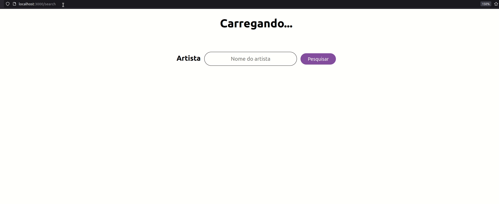
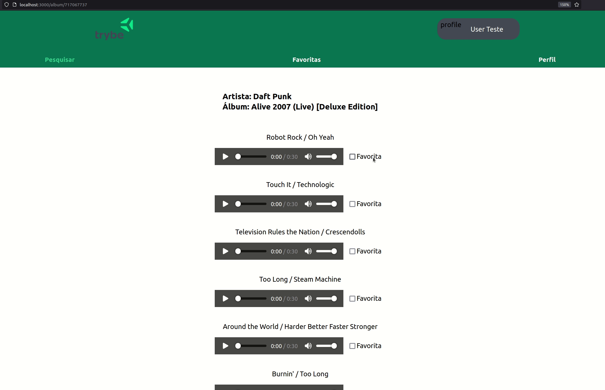
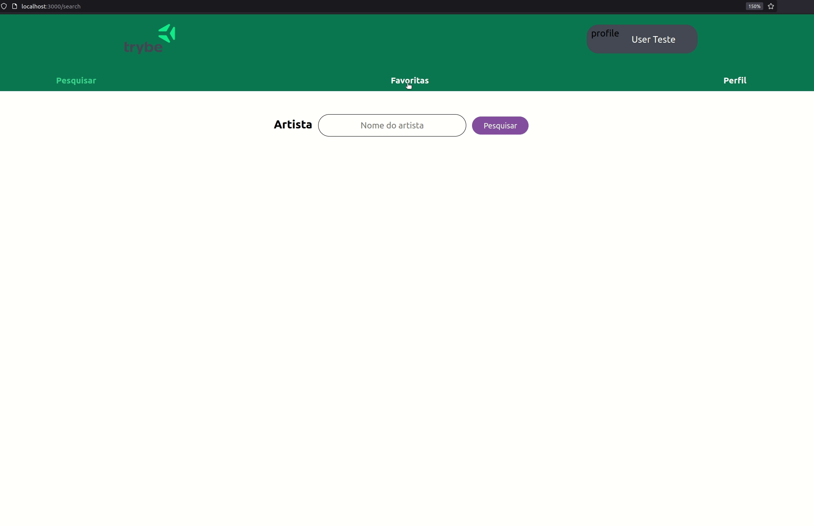
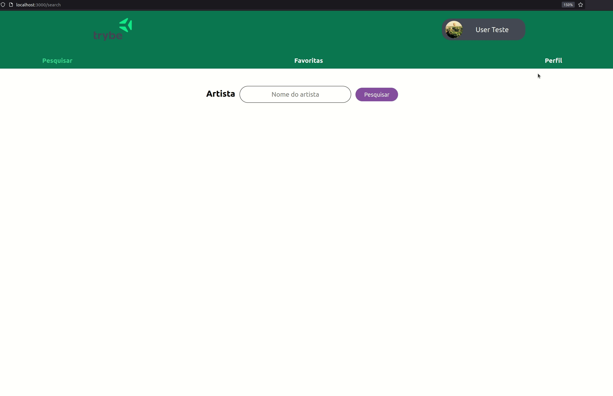
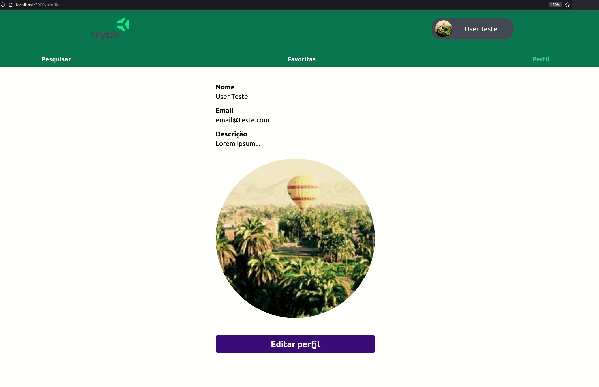
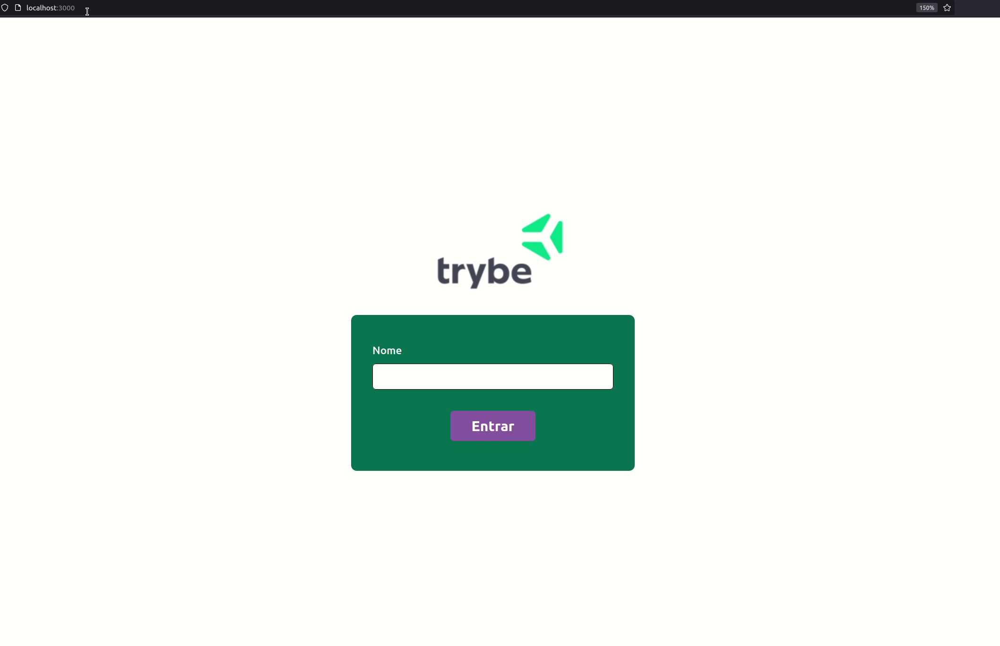
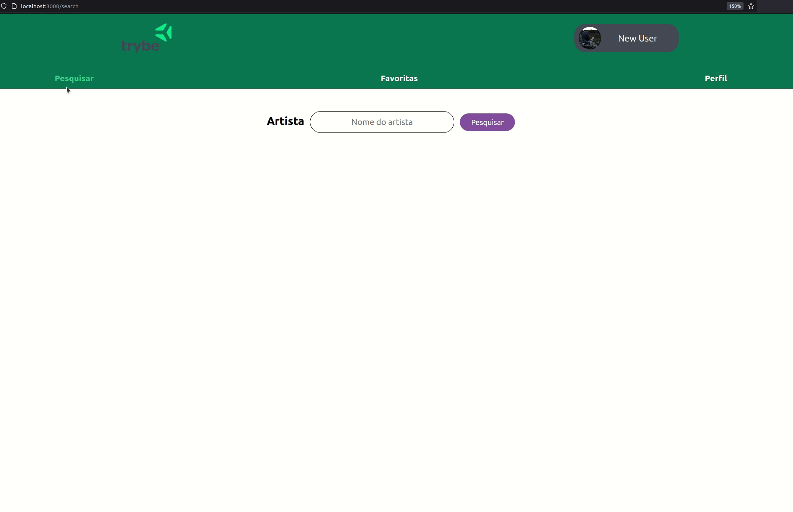

### Termos e acordos

Ao iniciar este projeto, você concorda com as diretrizes do Código de Ética e Conduta e do Manual da Pessoa Estudante da Trybe.

---

# Boas vindas ao repositório do projeto TrybeTunes!

Você já usa o GitHub diariamente para desenvolver os exercícios, certo? Agora, para desenvolver os projetos, você deverá seguir as instruções a seguir. Fique atento a cada passo, e se tiver qualquer dúvida, nos envie por _Slack_! #vqv 🚀

Aqui você vai encontrar os detalhes de como estruturar o desenvolvimento do seu projeto a partir deste repositório, utilizando uma branch específica e um _Pull Request_ para colocar seus códigos.

---

# Sumário

- [Habilidades](#habilidades)
- [Entregáveis](#entregáveis)
  - [O que deverá ser desenvolvido](#o-que-deverá-ser-desenvolvido)
  - [Desenvolvimento](#desenvolvimento)
  - [Data de Entrega](#data-de-entrega)
- [Instruções para entregar seu projeto](#instruções-para-entregar-seu-projeto)
  - [Antes de começar a desenvolver](#antes-de-começar-a-desenvolver)
  - [Durante o desenvolvimento](#durante-o-desenvolvimento)
  - [Depois de terminar o desenvolvimento (opcional)](#depois-de-terminar-o-desenvolvimento-opcional)
- [Como desenvolver](#como-desenvolver)
  - [Linter](#linter)
  - [Execução de testes unitários](#execução-de-testes-unitários)
- [Requisitos do projeto](#requisitos-do-projeto)
  - [1. Crie uma tela para que a pessoa usuária se identifique](#1-crie-uma-tela-para-que-a-pessoa-usuaria-se-identifique)
  - [2. Crie uma página para pesquisar artistas](#2-crie-uma-pagina-para-pesquisar-artistas)
  - [3. Faça a requisição para pesquisar artistas](#3-faça-a-requisicao-para-pesquisar-artistas)
  - [4. Crie a requisição que busca as músicas do álbum](#4-crie-a-requisicao-que-busca-as-musicas-do-album)
  - [5. Crie a página de listagem das músicas do álbum selecionado](#5-crie-a-pagina-de-listagem-das-musicas-do-album-selecionado)
  - [6. Crie o mecanismo de favoritar músicas](#6-crie-o-mecanismo-de-favoritar-musicas)
  - [7. Crie a página de listagem de músicas favoritas](#7-crie-a-pagina-de-listagem-de-musicas-favoritas)
  - [8. Crie a página de exibição de perfil](#8-crie-a-pagina-de-exibicao-de-perfil)
  - [9. Crie a página de edição de perfil](#9-crie-a-pagina-de-edicao-de-perfil)
  - [10. Crie uma rota de "Página não encontrada" e valide o acesso das rotas para pessoas logadas](#10-crie-uma-rota-de-pagina-nao-encontrada-e-valide-o-acesso-das-rotas-para-pessoas-logadas)
  - [11. Destaque a página atual nos links de navegação](#11-destaque-a-pagina-atual-nos-links-de-navegacao)
- [Avisos Finais](#avisos-finais)

---

# Habilidades
Neste projeto, verificamos se voce é capaz de:

  * Fazer requisições e consumir dados vindos de uma `API`;

  * Utilizar os ciclos de vida de um componente React;

  * Utilizar a função `setState` de forma a garantir que um determinado código só é executado após o estado ser atualizado;
  
  * Utilizar o componente `BrowserRouter` corretamente;

  * Criar rotas, mapeando o caminho da URL com o componente correspondente, via `Route`;

  * Utilizar o `Switch` do `React Router`;

  * Usar o componente `Redirect` pra redirecionar para uma rota específica;

  * Criar links de navegação na aplicação com o componente `Link`.


---

# Entregáveis

## O que deverá ser desenvolvido

Neste projeto você irá criar o TrybeTunes, uma aplicação capaz de reproduzir músicas das mais variadas bandas e artistas, criar uma lista de músicas favoritas e editar o perfil da pessoa usuária logada. Essa aplicação será capaz de:

  - Fazer login;
  - Pesquisar por uma banda ou artista;
  - Listar os álbuns disponíveis dessa banda ou artista;
  - Visualizar as músicas de um álbum selecionado;
  - Reproduzir uma prévia das músicas deste álbum;
  - Favoritar e desfavoritar músicas;
  - Ver a lista de músicas favoritas;
  - Ver o perfil da pessoa logada;
  - Editar o perfil da pessoa logada;

Para entregar o seu projeto você deverá criar um Pull Request neste repositório.

Lembre-se que você pode consultar nosso conteúdo sobre [Git & GitHub](https://course.betrybe.com/intro/git/) sempre que precisar!


## Desenvolvimento

Nos últimos projetos, por mais que o app tenha sido desenvolvido utilizando múltiplos componentes, o que é uma boa prática, todas as funcionalidades eram acessadas ao mesmo tempo, no mesmo lugar, utilizando apenas uma URL (`localhost:3000`, normalmente). À medida que seus apps se tornarem maiores e mais complexos, isso se tornará inviável. Desta vez, as funcionalidades do app serão agrupadas e organizadas em rotas.

Uma rota define o que deve ser renderizado na página ao abri-la. Cada rota está associada a um caminho. O caminho é a parte da URL após o domínio (nome do site, de forma simplificada). Por exemplo, em `www.site.com/projetos/meu-jogo`, o caminho é `/projetos/meu-jogo`. Até agora, todos os apps React que você desenvolveu possuíam somente uma rota, a raiz (`/`).

Outra diferença importante neste projeto em relação aos anteriores é que os dados virão de uma API (simulada) e não mais de um arquivo estático. Você utilizará essa API para criar, ler, atualizar e apagar filmes. Logo, você terá que lidar com requisições assíncronas e promises. Também deverá fazer uso de lifecycle methods e de estados para controlar o que é renderizado por seus componentes, a depender de que momento as requisições se encontram.

## Data de Entrega

  - Projeto individual.

  - Serão `X` dias de projeto.
  
  - Data de entrega para avaliação final do projeto: `DD/MM/YYYY - 14:00h`.

---

# Instruções para entregar seu projeto

## Antes de começar a desenvolver

1. Clone o repositório
  * `git clone git@github.com:tryber/sd-0x-project-trybetunes.git`.
  * Entre na pasta do repositório que você acabou de clonar:
    * `cd sd-0x-project-trybetunes`

2. Instale as dependências e inicialize o projeto
  * Instale as dependências:
    * `npm install`
  * Inicialize o projeto:
    * `npm start` (uma nova página deve abrir no seu navegador com um texto simples)
  * Verifique que os testes estão executando:
    * `npm test` (os testes devem rodar e falhar)

3. Crie uma branch a partir da branch `master`

  * Verifique que você está na branch `master`
    * Exemplo: `git branch`
  * Se não estiver, mude para a branch `master`
    * Exemplo: `git checkout master`
  * Agora, crie uma branch onde você vai guardar os commits do seu projeto
---

## Durante o desenvolvimento

* Faça `commits` das alterações que você fizer no código regularmente

* Lembre-se de sempre após um (ou alguns) `commits` atualizar o repositório remoto

* Os comandos que você utilizará com mais frequência são:
  1. `git status` _(para verificar o que está em vermelho - fora do stage - e o que está em verde - no stage)_
  2. `git add` _(para adicionar arquivos ao stage do Git)_
  3. `git commit` _(para criar um commit com os arquivos que estão no stage do Git)_
  4. `git push -u nome-da-branch` _(para enviar o commit para o repositório remoto na primeira vez que fizer o `push` de uma nova branch)_
  5. `git push` _(para enviar o commit para o repositório remoto após o passo anterior)_

---

## Depois de terminar o desenvolvimento (opcional)

Para **"entregar"** seu projeto, siga os passos a seguir:

* Vá até a página **DO SEU** _Pull Request_, adicione a label de _"code-review"_ e marque seus colegas
  * No menu à direita, clique no _link_ **"Labels"** e escolha a _label_ **code-review**
  * No menu à direita, clique no _link_ **"Assignees"** e escolha **o seu usuário**
  * No menu à direita, clique no _link_ **"Reviewers"** e digite `students`, selecione o time `tryber/students-sd-00`

---

# Como desenvolver

Este repositório já contém um template com um App React criado. Após clonar o projeto e instalar as dependências (mais sobre isso abaixo), você deverá completar este template implementando os requisitos listados na sessão [Requisitos do Projeto](#requisitos-do-projeto).

Além do componente `App.js`, você irá encontrar um diretório chamado `pages`, onde estarão os componentes que você irá utilizar para renderizar cada página em sua respectiva rota.

Também já existe no projeto um diretório `src/services`, que contém os arquivos `favoriteSongsAPI.js`, `searchAlbumsAPI.js`, `userAPI.js` e `musicsAPI.js`. Esses arquivos serão resposáveis por lidar com as requisições simuladas que serão usadas no desenvolvimento.

## `userAPI.js`

O arquivo `userAPI.js` será utilizado para manipular as informações da pessoa logada, dentro dele estarão as funções para recuperar as informações da pessoa usuária, criar um novo perfil e atualizar as informações da pessoa logada já existente. Todas essas funções simulam o funcionamento de uma API.

Para recuperar as informações da pessoa usuária,  utilize a função `getUser`. Ela retornará um objeto com as informações da pessoa logado caso exista, caso não exista retornará um objeto vazio.

Para criar um novo perfil, utilize a função `createUser`, ela recebe como parâmetro o objeto que contém as informações da pessoa usuária. Esse objeto deverá conter a seguinte estrutura:

```
{
  name: '',
  email: '',
  image: '',
  description: '',
}
```

Para atualizar as informações da pessoa logada, utilize a função `updateUser`, assim como a função anterior, ela também recebe um objeto com as informações que serão atualizadas, esse objeto deve conter a mesma estrutura do anterior.

## `searchAlbumsAPI.js`

O arquivo `searchAlbuns.js` contém uma função que faz uma requisição a uma API e retorna os álbuns de uma banda ou artista. Para essa função funcionar, ela recebe como parâmetro uma string, que deve ser o nome da banda ou artista que você queira pesquisar os álbuns. O retorno dessa função quando encontra as informações é um array com cada álbum da banda ou artista dentro de um objeto. **Mas atenção:** caso não encontre nenhuma informação da banda ou artista, a API retornará um array vazio.

## `favoriteSongsAPI.js`

O arquivo `favoriteSongsAPI.js` é responsável por manipular as informações das músicas favoritas. Nele há as funções `getFavoriteSongs`, `addSong` e `removeSong`, para recuperar, adicionar e remover músicas dos favoritos, respectivamente. Assim como nos arquivos anteriores, todas as funções simulam o funcionamento de uma API.

A função `getFavoriteSongs` retorna um array com as músicas favoritas ou um array vazio, caso não haja nenhuma música.

A função `addSong` recebe um objeto que representa a música que você quer salvar como favorita e adiciona ao array já existente das músicas que já foram favoritadas.

A função `removeSong` também recebe um objeto que representa a música que você deseja remover da lista de músicas favoritas.

**Atenção:** os objetos de música precisam ter a chave `trackId` para que as músicas seja adicionadas e removidas corretamente.

## `musicsAPI.js`

Esse arquivo estará vazio inicialmente e você irá preencher ele com a requisição para a API, durante a resolução dos requisitos.

## Linter

Para garantir a qualidade do código, vamos utilizar neste projeto o linter ESLint. Assim o código estará alinhado com as boas práticas de desenvolvimento, sendo mais legível e de fácil manutenção! Para rodar o *linter* localmente no projeto, execute o comando abaixo:

`npm run lint`

⚠️ **PULL REQUESTS COM ISSUES DE LINTER NÃO SERÃO AVALIADAS. ATENTE-SE PARA RESOLVÊ-LAS ANTES DE FINALIZAR O DESENVOLVIMENTO!** ⚠

Os testes foram desenvolvidos para permitir uma maior liberdade para estruturar e estilizar a página, portanto, abusem da criatividade! 😉

---


## Execução de testes unitários

Vamos utilizar [React Testing Library](https://testing-library.com/docs/react-testing-library/intro) para execução dos testes unitários.

Esse _framework_ de testes utiliza algumas marcações no código para verificar a solução proposta, uma dessas marcações é o atributo `data-testid` e faremos uso dele aqui.

Na descrição dos requisitos (logo abaixo) será pedido que seja feita a adição de atributos `data-testid` nos elementos _HTML_. Vamos a um exemplo para deixar claro essa configuração:

Se o requisito pedir "crie um botão e adicione o id de teste (ou `data-testid`) com o valor `my-action`, você pode criar:

```html
<button data-testid="my-action"></button>
```

ou

```html
<a data-testid="my-action"></a>
```

ou seja, o atributo `data-testid="my-action"` servirá para o React Testing Library(RTL) identificar o elemento e dessa forma, conseguiremos realizar testes unitários focados no comportamento da aplicação.

**ATENÇÃO!** Muito cuidado com os nomes especificados nos requisitos! O conteúdo deve ser exatamente igual ao texto descrito no requisito.

Afim de verificar a solução proposta, você pode executar todos os testes unitários localmente, basta executar:

```bash
npm test
```

### Dica: desativando testes

Especialmente no início, quando a maioria dos testes está falhando, a saída após executar os testes é bastante poluída. Você pode desabilitar temporariamente um teste utilizando a função `skip` junto à função `it`. Como o nome indica, esta função "pula" um teste:

```js
it.skip('Será validado se existe uma página para rotas não mapeadas', () => {
  renderPath('/not-found');

  expect(screen.getByText('Página não encontrada')).toBeInTheDocument();
});
```


Uma estratégia é pular todos os testes no início e ir implementando um teste de cada vez, removendo dele a função `skip`.

Você também pode rodar apenas um arquivo de teste, por exemplo:

```bash
npm test 01.LoginPage.test.js
```

Uma outra forma para driblar esse problema é a utilização da função `.only` após o `it`. Com isso, será possível que apenas um requisito rode localmente e seja avaliado.

```js
it.only('Será validado se existe uma página para rotas não mapeadas', () => {
  renderPath('/not-found');

  expect(screen.getByText('Página não encontrada')).toBeInTheDocument();
});
```


---

# Requisitos do projeto
:warning: **PULL REQUESTS COM ISSUES DE LINTER NÃO SERÃO AVALIADAS.** :warning:
## 1. Crie uma tela para que a pessoa usuária se identifique:

Crie uma página para que a pessoa usuária se identifique com um nome. Esta página deve ser a página inicial de sua aplicação.

  * A rota para esta página deve ser `/`.

  * Você deve criar um campo para que a pessoa usuária insira seu nome. Este campo deverá ter o atributo `data-testid="login-name-input"`.

  * Crie um botão com o texto ‘Entrar’ Este botão deverá ter o atributo `data-testid="login-submit-button"`.

  * O botão para entrar só deve ser habilitado caso o nome digitado tenha mais de 3 caracteres.

  * Ao clicar no botão `Entrar`, utilize a `userAPI` para salvar o nome da pessoa usuária.

  * Enquanto a informação da pessoa usuária é salva, uma mensagem com o texto `Carregando...` deve aparecer na tela. Dica: Você irá precisar dessa mensagem várias vezes no futuro, então é uma boa ideia criar um componente para ela ;)

  * Após a informação ter sido salva, faça um redirect para a rota `/search`.

  
  ### O que será verificado:

  - Será validado se ao navegar para a rota `/`, o input e o botão especificados estão presentes;

  -Será validado se o botão só é habilitado se o input de nome tiver 3 ou mais caracteres;

  - Será validado se ao clicar no botão habilitado, a função `createUser` da `userAPI` é chamada; Lembre-se que a função `createUser` espera receber como argumento um objeto no seguinte formato: 

  ```
  {
    name: '',
    email: '',
    image: '',
    description: '',
  }
  ```

  - Será validado se ao clicar no botão, a mensagem `Carregando...` é exibida e após a resposta da API acontece o redirecionamento para a rota `/search`.
  

## 2. Crie uma página para pesquisar artistas:
Essa página deve conter um input e um botão para que seja possível pesquisar os álbums de uma banda ou artista.

  * A rota para esta página deve ser `/search`.

  * Utilize a função `getUser` da `userAPI` para recuperar o nome da pessoa logada e exiba essa informação na tela. Você pode usar qualquer tag HTML que faça sentido, desde que ela tenha o atributo `data-testid="header-user-name"`.

  * Enquanto estiver aguardando a resposta da `getUser`, exiba apenas a mensagem de `Carregando...` (você já criou componente para ela, não é?).

  * Crie um campo para pessoa digitar o nome da banda ou artista a ser pesquisada. Esse campo deve ter o atributo `data-testid="search-artist-input"`.
  
  * Crie um botão com o texto "Pesquisar". Esse botão deve ter o atributo `data-testid="search-artist-button"`.

  * O botão só deve estar habilitado caso o nome do artista tenha 2 ou mais caracteres.

  
  ### O que será verificado:

  - Será validado se ao navegar para a rota `/search`, o nome da pessoa usuária está presente na tela;

  - Será validado se ao navegar para a rota `/search`, o input e o botão estão presentes na tela;

  - Será validado se o botão está habilitado somente se o input de nome tiver 2 ou mais caracteres;

## 3. Faça a requisição para pesquisar artistas:
Com a estrutura da tela de pesquisa criada, agora é hora de fazer uma requisição e receber a lista de álbums da banda ou artista pesquisada.

  * Ao clicar no botão de "Pesquisar", limpe o valor do input e faça uma requisição utilizando a função do arquivo `searchAlbuns.js`. Lembre-se que essa função espera receber uma string com o nome da banda ou artista.

  * Enquanto aguarda a resposta da API, esconda o input e o botão de pesquisa e exiba a mensagem `Carregando...` na tela.

  * Após receber a resposta da requisição exibir na tela o texto `"Pesquisando álbuns de: <artista>"`, onde `<artista>` é o nome que foi digitado no input.

  * Liste os álbuns retornados. A API irá retorna um *array* de objetos. Cada objeto terá a seguinte estrutura: 
  ```
  [
    {
      artistId: 12,
      artistName: "Artist Name",
      collectionId: 123,
      collectionName: "Collection Name",
      collectionPrice: 12.25,
      artworkUrl100: "https://url-to-image",
      releaseDate: "2012-03-02T08:00:00Z",
      trackCount: 8,
    }
  ]

  ```

  * Ao listar os álbuns, crie um link em cada card para redirecionar para a página do álbum. Este link deve ter o atributo ```data-testid={\`link-to-album-${collectionId}\`}```. Onde `collectionId` é o valor da propriedade de cada Álbum.

  * Este link deve redirecionar para a rota `/album/:id`, onde `:id` é o valor da propriedade `collectionId` de cada Álbum da lista recebida pela API.

  * Se nenhum álbum for encontrado para o nome pesquisado, a API irá retornar um array vazio. Nesse caso, a mensagem `Nenhum álbum foi encontrado` deverá ser exibida.

  

### O que será verificado:
  - Será validado se ao clicar em "pesquisar", a requisição é feita usando a `searchAlbumsAPI`;

  - Será validado se ao receber o retorno da API, o texto `"Pesquisando álbuns de: <artista>"` está na tela e os álbuns são listados;

  - Será validado se caso a API não retorne nenhum álbum, a mensagem `Nenhum álbum foi encontrado` é exibida;

  - Será validado se existe um link para cada álbum listado que redirecione para a rota `/album/:id`.

## 4. Crie a requisição que busca as músicas do álbum':
Até o momento você estava utilizando as funções fornecidas na pasta `src/services`, mas agora você irá criar sua própria chamada para a API, dentro do arquivo `musicsAPI.js`.

A sua missão é usar a função `fetch` para fazer uma requisição para a API `https://itunes.apple.com/lookup?id=${id}&entity=song`, onde `${id}` é o `collectionId` do Álbum. Lembre-se de que requisições são assíncronas e o `fetch` retorna uma promise.

Além disso, ao receber o retorno da API, você irá precisar chamar a função `json()`, que também retorna uma promise. E no objeto retornado pela função `json()`, você encontrará o array com as música dentro a chave `results`.

**Dica:** você pode dar uma olhada no arquivo `serachAlbums.js`, a implementação dessa função é bastante semelhante com o que você precisa implementar aqui ;) 

A função `getMusics` deverá retornar um array com as músicas do álbum selecionado.

### O que será verificado:
  - Será validado se a função recebe o id do álbum e chama a API do iTunes;

  - Será validado se a função retorna o valor recebido pela API do iTunes'.

## 5. Crie a página de listagem das músicas do álbum selecionado:
Agora que está tudo pronto, você poderá exibir a lista de músicas do álbum selecionado.

  * A rota para esta página deve ser `/album/:id`.

  * Utilize a função `getUser` da `userAPI` para recuperar o nome da pessoa logada e exiba essa informação na tela. Você pode usar qualquer tag HTML que faça sentido, desde que ela tenha o atributo `data-testid="header-user-name"`.
  
  * Enquanto estiver aguardando a resposta da `getUser`, exiba apenas a mensagem de `Carregando...`.

  * Ao entrar na página,  utilize a função `getMusics` da `musicsAPI` (criada no requisito anterior) para fazer a requisição das músicas do álbum selecionado. Lembre-se que você deve pegar o id do álbum através do parâmetro `:id` passado pela URL.

  * Enquanto estiver aguardando a resposta da `getMusics`, exiba apenas a mensagem de `Carregando...` onde as músicas serão listadas. O elemento que mostra o nome da pessoa usuária logada deve permanecer na tela.

  * Exiba o nome da banda ou artista na tela. Você pode usar qualquer tag HTML que faça sentido, desde que ela tenha o atributo `data-testid="artist-name"`.

  * Exiba o nome do álbum e nome da banda ou artista na tela. Você pode usar qualquer tag HTML que faça sentido, desde que ela tenha o atributo `data-testid="album-name"`.

  * Liste todas as músicas do álbum na tela. Para isso, utilize o componente `MusicCard` que está no `src/components`, o mesmo deverá exibir o nome da música (propriedade `trackName` no objeto recebido pela API) e um player para tocar o preview da música (propriedade `previewUrl` no objeto recebido pela API).

  Para tocar o preview, você deve usar a tag `audio` do próprio HTML. Sua implementação é assim:
  ```javascript
  <audio data-testid="audio-component" src={ previewUrl } controls>
    <track kind="captions" />
      O seu navegador não suporta o elemento <code>audio</code>.
  </audio>
  ```
  **Importante:** lembre-se de colocar o atributo `data-testid="audio-component"` na tag `audio` de cada música listada.

  * Adicione um link no cabeçalho da página que redireciona para página de pesquisa (rota `/search`) ao ser clicado. Esse link deve ter o atributo `data-testid="link-to-search"`.


### O que será verificado:
  - Será validado se a rota `/album/:id` é uma rota existente';
  - Será validado se o nome da pessoa usuária está presente na tela;
  - Será validado se existe um link para a página de pesquisa no cabeçalho;
  - Será validado se o serviço de `musicsAPI` está sendo chamado;
  - Será validado se o nome da banda ou artista e o nome do álbum são exibidos;
  - Será validado se todas músicas retornadas pela API são listadas.

## 6. Crie o mecanismo de favoritar músicas:
Você já consegue listar as músicas dos álbuns, nessa etapa você irá poder marcar quais são as músicas que você mais gosta.

  * No componente `MusicCard`, crie um input do tipo `checkbox` para marcar as músicas favoritas. Esse input deve conter uma `label`, e a `label` deve ter o atributo ```data-testid={`checkbox-music-${trackId}`}```, onde `trackId` é a propriedade `trackId` do objeto recebido pela API.

  * Para adicionar uma música a lista de favoritas, utilize a função `addSong` da `favoriteSongsAPI`. Você pode passar para essa função um objeto no mesmo formato que você recebe da API `getMusics`.

  * Enquanto aguarda o retorno da função `addSong`, renderize a mensagem de `Carregando...`.

  * Ao clicar em uma música que já está marcada como favorita, ela deve ser removida da lista de músicas favoritas. Para isso você deve usar a função `removeSong` da `favoriteSongsAPI`. Essa API espera receber um objeto no mesmo formato que foi passado anteriormente para a função `addSong`.

  * Enquanto aguarda o retorno da função `removeSong`, renderize a mensagem de `Carregando...`.

### O que será verificado:
- Será validado se existe o checkbox para adicionar músicas na lista de favoritas;

- Será validado se é possível remover músicas da lista de favoritas.



## 7. Crie a página de listagem de músicas favoritas:

  * A rota para esta página deve ser `/favorites`.

  * Utileze o arquivo `FavoriteSongs` da pasta `src/pages`.

  * Utilize a função `getUser` da `userAPI` para recuperar o nome da pessoa logada e exiba essa informação na tela. Você pode usar qualquer tag HTML que faça sentido, desde que ela tenha o atributo `data-testid="header-user-name"`.
  
  * Enquanto estiver aguardando a resposta da `getUser`, exiba apenas a mensagem de `Carregando...`.

  * Exiba o link que redireciona para a página de pesquisa no cabeçalho da página. Lembre-se que esse link deve ter o atributo `data-testid="link-to-search"`.

  * Adicione um link no cabeçalho da página que redireciona para página de músicas favoritas (rota `/favorites`) ao ser clicado. Esse link deve ter o atributo `data-testid="link-to-favorites"`.

  * Ao entrar na página, utilize a função `getFavoriteSongs` da `favoriteSongsAPI` para recuperar a lista de músicas favoritas.

  * Enquanto aguarda a resposta da API, exiba a mensagem "Carregando...".

  * Após receber o retorno da função `getFavoriteSongs`, utilize o  componente `Music` para renderizar a lista de músicas favoritas.

  * Nesta página deve ser possível desfavoritar as músicas. Para isso utilize a função `removeSong` da `favoriteSongsAPI`.

  * Enquanto aguarda a resposta da API, exiba a mensagem "Carregando...".

  * Após remover a música, atualize a lista usando a função `getFavoriteSongs`. Lembre-se de exibir a mensagem "Carregando..." enquanto aguarda o retorno da API.

### O que será verificado:
- Será validado se a rota `/favorites` é uma rota existente;

- Será validado se o nome da pessoa usuária e o link para página de pesquisa são exibidos na tela;

- Será validado se exite um link para a página de músicas favoritas no cabeçalho;

- Será validado se a requisição para `getFavoriteSongs` é feita para  recuperar as músicas favoritas';

- Será validado se é exibida a lista de músicas favoritas;

- Será validado se a lista de músicas favoritas é atualizada ao remover uma música da lista.



## 8. Crie a página de exibição de perfil:

  * A rota para esta página deve ser `/profile`.

  * Utiliza o arquivo `Profile.js`, da pasta `src/pages`.

  * Utilize a função `getUser` da `userAPI` para recuperar o nome da pessoa logada e exiba essa informação na tela. Você pode usar qualquer tag HTML que faça sentido, desde que ela tenha o atributo `data-testid="header-user-name"`.
  
  * Enquanto estiver aguardando a resposta da `getUser`, exiba apenas a mensagem de `Carregando...`.

  * Exiba o link que redireciona para a página de pesquisa no cabeçalho da página. Lembre-se que esse link deve ter o atributo `data-testid="link-to-search"`.

 * Exiba o link que redireciona para a página de músicas favoritas no cabeçalho da página. Lembre-se que esse link deve ter o atributo `data-testid="link-to-favorites"`.

  * Adicione um link no cabeçalho da página que redireciona para página de exibição de perfil (rota `/profile`) ao ser clicado. Esse link deve ter o atributo `data-testid="link-to-profile"`.

  * Utilize a função `getUser` da `userAPI` para recuperar as informações da pessoa logada e exiba essas informações na tela.

  * Enquanto aguarda a resposta da API, exiba a mensagem "Carregando...".

  * Exiba uma tag `img` para mostrar a foto da pessoa usuária. Este campo precisa ter o atributo `data-testid="profile-image"`;



### O que será verificado:
  - Será validado se a rota `/profile` é uma rota existente;

  - Será validado se o nome da pessoa usuária, o link para página de pesquisa e o link para a página de músicas favoritas são exibidos na tela;

  - Será validado se existe um link para a página de perfil no cabeçalho;

  - Será validado se é feita a requisição `getUser` para recuperar e exibir informações do usuário;

  - Será validado se existe uma tag `img` com um texto alternativo.

## 9. Crie a página de edição de perfil:

  * A rota para esta página deve ser `/profile`.

  * Na página de exibição de perfil (rota `/profile`) crie um link que redirecione para a página de edição de perfil  (rota `/profile/edit`). Este link deve ter o texto `Editar perfil`.

  * Utilize a função `getUser` da `userAPI` para recuperar o nome da pessoa logada e exiba essa informação na tela. Você pode usar qualquer tag HTML que faça sentido, desde que ela tenha o atributo `data-testid="header-user-name"`.
  
  * Enquanto estiver aguardando a resposta da `getUser`, exiba apenas a mensagem de `Carregando...`.

  * Exiba o link que redireciona para a página de pesquisa no cabeçalho da página. Lembre-se que esse link deve ter o atributo `data-testid="link-to-search"`.

  * Exiba o link que redireciona para a página de músicas favoritas no cabeçalho da página. Lembre-se que esse link deve ter o atributo `data-testid="link-to-favorites"`.

  * Exiba o link que redireciona para a página de exibição de perfil no cabeçalho da página. Lembre-se que esse link deve ter o atributo `data-testid="link-to-profile"`.

  * Utilize a função `getUser` da `userAPI` para recuperar as informações da pessoa logada.

  * Enquanto aguarda a resposta da API, exiba a mensagem "Carregando...".

  * Após receber as informações da pessoa logada, renderize um formulário já preenchido com os seguintes campos:

    * Um campo para alterar o nome da pessoa usuária. Este campo precisa ter o atributo `data-testid="edit-input-name"`;

    * Um campo para alterar o email da pessoa usuária. Este campo precisa ter o atributo `data-testid="edit-input-email"`;

    * Um campo para alterar a descrição da pessoa usuária. Este campo precisa ter o atributo `data-testid="edit-input-description"`;

    * Um campo para alterar a foto da pessoa usuária. Este campo precisa ter o atributo `data-testid="edit-input-image"`;

    * Um botão para salvar as informações alteradas. Este botão precisa ter o atributo `data-testid="edit-button-save"`.

  * Para poder habilitar o botão de enviar, todos os campos precisam estar preenchidos (não podem estar vazios).

  * O campo de email, além de não estar vazio também precisa verificar que o email tem um formato válido, ou seja, deve seguir o padrão `test@test.com`.
  
  * O botão de salvar as informações só deve ser habilitado quando todos os campos estiverem válidos, ou seja, todos campos preenchidos e o campo de email com um valor em formato válido.

  * Quando o botão estiver habiltado, utilize a função `updateUser` da `userAPI` para atualizar as informações da pessoa usuária. Essa API espera receber um objeto no seguinte formato:
  ```
    {
      name: '',
      email: '',
      image: '',
      description: '',
    }
  ```

  * Enquanto aguarda a resposta da API, exiba a mensagem "Carregando...".

  * Ao finalizar o processo de edição, redirecione a pessoa logada para a página de exibição de perfil (rota `/profile`).



### O que será verificado:
- Será validado se a rota `/profile/edit` é uma rota existente;

- Será validado se o nome da pessoa usuária, o link para página de pesquisa, o link para a página de músicas favoritas e o link para a página de perfil são exibidos na tela;

- Será validado se foi criado um link para a rota de edição de perfil na página de exibição de perfil;

- Será validado se é feita a requisição para `getUser` para recuperar as informações da pessoa logada;

- Será validado se o formulário é renderizado já preenchido com as informações da pessoa logada;

- Será validado se é possível alterar os valores dos campos;

- Será validado se o botão `salvar` é habilitado somente se todos os campos estiverem válidos;

- Será validado se as informações são enviadas usando a API `updateUser`;

- Será validado se após salvar as informações a pessoa é redirecionada para a página de exibição de perfil.

## 10. Crie uma rota de "Página não encontrada" e valide o acesso das rotas para pessoas logadas:

  * Crie uma página para as rotas não mapeadas, ou seja, quando a pessoa tentar uma rota que não existe, é exibida a mensagem "Página não encontrada".

  * Quando a rota `/` for acessada, utilize a função `getUser` da `userAPI` para recuperar as informações da pessoa usuária. Enquanto estiver aguardando a resposta da `getUser`, exiba apenas a mensagem de `Carregando...`.

  * Após receber o retorno da `getUser`, verifique se a pessoa está logada (se não houver nenhuma pessoa logada, a `getUser` irá retornar um objeto vazio). Se ela **já estiver logada** faça um redirecionamento para a rota `/search`.

  * Quando alguma rota válida for acessada, utilize a função `getUser` da `userAPI` para recuperar as informações da pessoa usuária. Enquanto estiver aguardando a resposta da `getUser`, exiba apenas a mensagem de `Carregando...`. Lembre-se de que as rotas válidas são:
`/search`, `/album/:id`, `/favorites`, `/profile`, `/profile/edit`.

  * Após receber o retorno da `getUser`, verifique se a pessoa está logada (se não houver nenhuma pessoa logada, a `getUser` irá retornar um objeto vazio). Se ela **não estiver logada** faça um redirecionamento para a rota `/search`.


### O que será verificado:
  - Será validado se existe uma página para rotas não mapeadas e que o texto "Página não encontrada" é exibido;

  - Será validado se quando a pessoa logada acessa a rota `/` ela é redirecionada para a rota `/search`;

  - Será validado se a pessoa é redirecionada para a rota `/` se ela não estiver logada e tentar acessar outra rota válida.

## 11. Destaque a página atual nos links de navegação:
Ao navegar entre as páginas, é importante que a pessoa usuária saiba com facilidade em qual página está. Uma boa técnica para alcançar esse objetivo é dar destaque para o link da página atual no menu de navegação.
Você pode estilizar o link da maneira que achar melhor, desde que o link destacado possua a classe `active`.

  * Caso a pessoa usuária esteja na página de pesquisa (rota `/search`), o link para a página de pesquisa precisa estar destacado com a classe "active".

  * Caso a pessoa usuária esteja na página de músicas favoritas (rota `/favorites`), o link para a página de músicas favoritas precisa estar destacado com a classe "active".
  
  * Caso a pessoa usuária esteja na página de perfil (rota `/profile`), o link para a página de perfil precisa estar destacado com a classe "active".


### O que será verificado:
  - Será validado se o link para página de músicas favoritas é destacado na rota `/favorites`;

  - Será validado se o link para página de pesquisar é destacado na rota `/search`;

  - Será validado se o link para página de perfil é destacado na rota `/profile`.

---

# Avisos Finais

Ao finalizar e submeter o projeto, não se esqueça de avaliar sua experiência preenchendo o formulário. Leva menos de 3 minutos!

Link: [FORMULÁRIO DE AVALIAÇÃO DE PROJETO](https://bit.ly/2OfLJPn)

O avaliador automático não necessariamente avalia seu projeto na ordem em que os requisitos aparecem no readme. Isso acontece para deixar o processo de avaliação mais rápido. Então, não se assuste se isso acontecer, ok?

---
